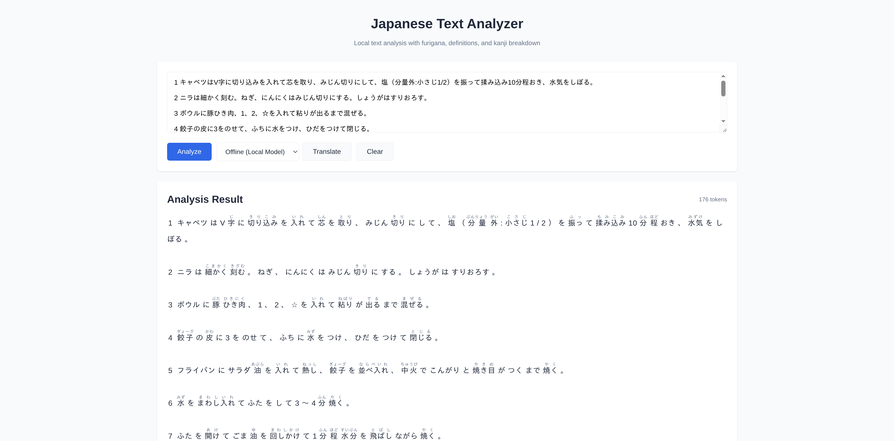
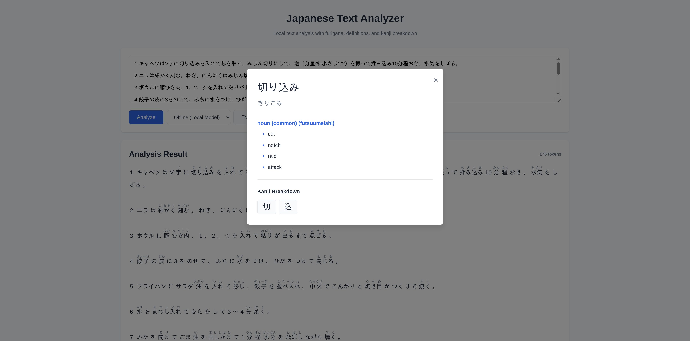
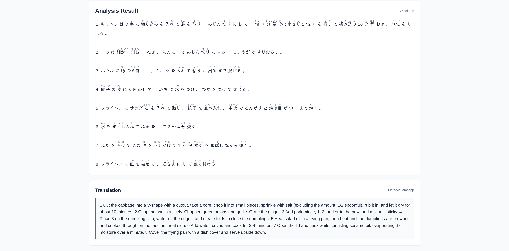

# Japanese Text Analyzer

A fully offline-capable Japanese text analysis tool with furigana display, word definitions, kanji breakdown, and machine translation. Runs entirely on your local machine with zero internet dependency (optional DeepL API integration available).

*Inspired by [Nihongodera Furigana Maker](https://nihongodera.com/tools/furigana-maker)*

## Features

- **Furigana Display**: Automatic hiragana readings above kanji characters
- **Word Definitions**: Click any word for English meanings, part of speech, and JLPT level (215k+ words from JMdict)
- **Kanji Breakdown**: Individual kanji information including readings, meanings, stroke count, and grade (13k+ kanji from KANJIDIC2)
- **Translation Options**:
  - **Offline Translation** (default): Fully local Japanese-English translation using LiquidAI LFM2-350M model - no API keys or internet required
  - **DeepL API** (optional): High-quality cloud translation for users who prefer it
  - **No Translation**: Analysis and dictionary features only
- **Text Formatting**: Preserves spaces and newlines in analyzed text
- **100% Offline Capable**: All core features (analysis, dictionaries, translation) can run locally with zero internet dependency
- **Cross-platform**: Works on Mac, Linux, and anywhere Docker runs

## Screenshots

### Furigana Analysis


The main interface displays analyzed Japanese text with automatic furigana (hiragana readings) above kanji. Users can switch between translation methods (Offline, DeepL, or None) using the dropdown menu.

### Word Definitions


Click any word to see detailed definitions organized by part of speech, including English meanings and clickable kanji for further exploration.

### Kanji Details


Individual kanji characters can be explored in depth, showing:
- On'yomi and kun'yomi readings
- English meanings
- Stroke count and school grade
- JLPT level and frequency rank
- Radical information

### Offline Translation


Fully offline translation powered by the LFM2-350M model running locally via llama.cpp. The translation method dropdown allows switching between:
- **Offline (Local Model)** - 100% private, no internet required
- **DeepL API** - High-quality cloud translation
- **No Translation** - Analysis only

The example shows a Japanese cooking recipe being translated to English entirely on your local machine, with the method indicator showing "llamacpp" to confirm it's using the offline model.

## Tech Stack

- **Backend**: FastAPI + SQLite + fugashi (MeCab wrapper)
- **Frontend**: Vanilla HTML/CSS/JavaScript
- **Dictionaries**: JMdict (215k+ words), KANJIDIC2 (13k+ kanji)
- **Translation**: llama.cpp with LFM2-350M-ENJP-MT model (GGUF, 219MB)
- **Deployment**: Docker Compose (3 services: backend, frontend, llamacpp)

## Quick Start

### Prerequisites

- Docker (with compose plugin)
- 2.5GB free disk space (dictionaries + database + translation model)
- 1GB RAM minimum (for Q4 quantized translation model)
- Internet connection (only for initial setup)

### Installation

1. **Clone the repository and navigate to it**
   ```bash
   git clone <your-repo-url>
   cd japanese-text-analyzer
   ```

2. **Copy the environment file**
   ```bash
   cp .env.example .env
   ```

   Optional: Edit `.env` to configure translation method (defaults to offline llamacpp)

3. **Initialize the database** (one-time setup, ~5-10 minutes)
   ```bash
   docker compose run --rm backend python scripts/init_database.py
   ```

   This will:
   - Download JMdict and KANJIDIC2 dictionaries
   - Create and populate the SQLite database
   - Import ~215k words and ~13k kanji

4. **Download the translation model** (one-time setup, ~1 minute)

   **Default (recommended for most users)**:
   ```bash
   python3 backend/scripts/download_translation_model.py
   ```
   Downloads Q4_K_M (229MB, 1-2GB RAM, good balance)

   **For different device specs**:
   ```bash
   # Low RAM (1GB):      Q4_0 - 219MB
   python3 backend/scripts/download_translation_model.py Q4_0

   # Better quality:     Q5_K_M - 260MB
   python3 backend/scripts/download_translation_model.py Q5_K_M

   # High quality:       Q8_0 - 379MB (requires 2-4GB RAM)
   python3 backend/scripts/download_translation_model.py Q8_0

   # List all options:
   python3 backend/scripts/download_translation_model.py --help
   ```

   If you downloaded a non-default quantization, update `.env`:
   ```bash
   MODEL_FILE=LFM2-350M-ENJP-MT-Q4_0.gguf  # or your chosen quantization
   ```

5. **Start the application**
   ```bash
   docker compose up -d
   ```

   This starts 3 services:
   - `backend`: FastAPI server (port 8000)
   - `frontend`: Nginx web server (port 3000)
   - `llamacpp`: Translation model server (port 8080)

6. **Access the application**
   - Frontend: http://localhost:3000
   - API Documentation: http://localhost:8000/docs

### First-Time Setup

The initialization scripts only need to be run once. All data is stored in the `data/` directory and persists between restarts.

### Stopping the Application

```bash
docker compose down
```

## Usage

1. Enter Japanese text in the input area
2. Click **Analyze** to see the text with furigana
3. Click any word to view definitions and meanings
4. Click any kanji in the definition popup to see detailed kanji information
5. Click **Translate** for full sentence translation (if configured)

## Configuration

### Translation Methods

The application is **fully offline by default**. All features work without internet access. You can optionally enable DeepL API for cloud translation if desired.

Edit the `.env` file to configure your preferred translation method:

**Option 1: Offline Translation (default)** - 100% local, no API or internet required
```
TRANSLATION_METHOD=llamacpp
```
Uses the LFM2-350M model running locally via llama.cpp. Completely private and offline. Requires model download (see Installation step 4).

**Option 2: DeepL API (optional)** - Cloud-based
```
TRANSLATION_METHOD=deepl
DEEPL_API_KEY=your-api-key-here
```
For users who prefer cloud translation and have internet access. Get a free API key at: https://www.deepl.com/pro-api

**Option 3: No translation**
```
TRANSLATION_METHOD=none
```
Disables translation feature entirely. Analysis and dictionary features still work fully offline.

After changing `.env`, restart the services:
```bash
docker compose down
docker compose up -d
```

### Performance Notes

- **Analysis**: Near-instant (MeCab tokenization)
- **Dictionary lookup**: < 50ms (SQLite indexed queries)
- **Translation (llamacpp)**: 2-5 seconds (CPU-based, depends on text length)
- **Translation (DeepL)**: 1-2 seconds (API call)

## Development

### Running Without Docker

#### Backend

```bash
cd backend

# Create virtual environment
python3 -m venv venv
source venv/bin/activate  # On Windows: venv\Scripts\activate

# Install dependencies
pip install -r requirements.txt

# Initialize database
python scripts/init_database.py

# Run server
uvicorn app.main:app --reload
```

Backend will be available at http://localhost:8000

#### Frontend

```bash
cd frontend

# Serve with Python
python3 -m http.server 3000
```

Frontend will be available at http://localhost:3000

## Project Structure

```
japanese-text-analyzer/
├── backend/
│   ├── app/
│   │   ├── main.py                      # FastAPI application
│   │   ├── config.py                    # Configuration
│   │   ├── database.py                  # Database setup
│   │   ├── models.py                    # SQLAlchemy models
│   │   ├── schemas.py                   # Pydantic schemas
│   │   ├── api/
│   │   │   └── routes.py                # API endpoints
│   │   └── services/
│   │       ├── analyzer.py              # Text analysis (MeCab)
│   │       ├── dictionary.py            # Word lookup
│   │       ├── kanji.py                 # Kanji lookup
│   │       └── translator.py            # Translation (llamacpp/DeepL)
│   ├── scripts/
│   │   ├── init_database.py             # Database initialization
│   │   ├── import_jmdict.py             # JMdict import
│   │   ├── import_kanjidic.py           # KANJIDIC import
│   │   └── download_translation_model.py # Model download
│   ├── requirements.txt
│   └── Dockerfile
├── frontend/
│   ├── index.html
│   ├── css/styles.css
│   ├── images/
│   │   └── logo.svg                     # Favicon
│   └── js/
│       ├── app.js                       # Main application
│       ├── api.js                       # API client
│       └── components/                  # UI components
│           ├── text-display.js          # Furigana rendering
│           ├── definition-popup.js      # Word definitions
│           └── kanji-details.js         # Kanji info modal
├── llamacpp/
│   └── Dockerfile                       # llama.cpp server config
├── data/
│   ├── dictionaries/                    # Downloaded dictionary files
│   ├── database/                        # SQLite database
│   └── models/                          # Translation model (GGUF)
├── docker-compose.yml                   # Multi-container orchestration
├── .env                                 # Configuration (translation method, API keys)
└── README.md
```

## API Endpoints

- `POST /api/analyze` - Analyze Japanese text
- `GET /api/word/{word}` - Get word definition
- `GET /api/kanji/{character}` - Get kanji information
- `POST /api/translate` - Translate text
- `GET /api/health` - Health check with database stats

Full API documentation: http://localhost:8000/docs

## Troubleshooting

### Database not initialized
```bash
docker compose run --rm backend python scripts/init_database.py
```

### Translation not working

**If using llamacpp**:
1. Verify model is downloaded:
   ```bash
   ls -lh data/models/LFM2-350M-ENJP-MT-Q4_K_M.gguf
   ```

2. Check llamacpp service is healthy:
   ```bash
   docker compose ps
   ```

3. Test llamacpp directly:
   ```bash
   curl http://localhost:8080/health
   ```

4. Check logs:
   ```bash
   docker compose logs llamacpp
   ```

**If using DeepL**:
- Verify API key is set in `.env`
- Check for API quota limits

### Backend cannot connect to database
Ensure the `data/database/` directory exists and has proper permissions:
```bash
mkdir -p data/database
chmod 755 data/database
```

### Frontend cannot connect to backend
1. Check all services are running: `docker compose ps`
2. Check backend health: `curl http://localhost:8000/api/health`
3. Check browser console for CORS errors

### Port already in use
Change ports in `docker-compose.yml`:
```yaml
ports:
  - "8001:8000"  # Backend
  - "3001:80"    # Frontend
  - "8081:8080"  # llamacpp
```

### Container won't start
Check logs for specific service:
```bash
docker compose logs backend
docker compose logs llamacpp
docker compose logs frontend
```

## Data Sources & Models

- **JMdict**: Japanese-English dictionary (215k+ entries) - [EDRDG](http://www.edrdg.org/jmdict/j_jmdict.html)
- **KANJIDIC2**: Kanji information (13k+ characters) - [EDRDG](http://www.edrdg.org/wiki/index.php/KANJIDIC_Project)
- **MeCab/UniDic**: Morphological analysis - [UniDic](https://unidic.ninjal.ac.jp/)
- **LFM2-350M**: Japanese-English translation model - [Liquid AI](https://huggingface.co/LiquidAI/LFM2-350M-ENJP-MT)
- **llama.cpp**: Efficient LLM inference - [ggml-org](https://github.com/ggml-org/llama.cpp)

## License

MIT License - See LICENSE file for details

**Third-Party Components**:
- Dictionary data (JMdict, KANJIDIC) is provided by the Electronic Dictionary Research and Development Group under CC BY-SA 4.0
- LFM2-350M model follows lfm1.0 license from Liquid AI
- All other dependencies retain their respective licenses

## Credits

**Inspiration**:
- [Nihongodera Furigana Maker](https://nihongodera.com/tools/furigana-maker) - Original inspiration for this project

**Open Source Components**:
- Electronic Dictionary Research and Development Group (EDRDG) - JMdict and KANJIDIC2 dictionaries
- Liquid AI - LFM2-350M translation model
- ggml-org - llama.cpp inference engine
- MeCab Project - morphological analyzer
- fugashi - Python MeCab wrapper
- FastAPI - backend framework
